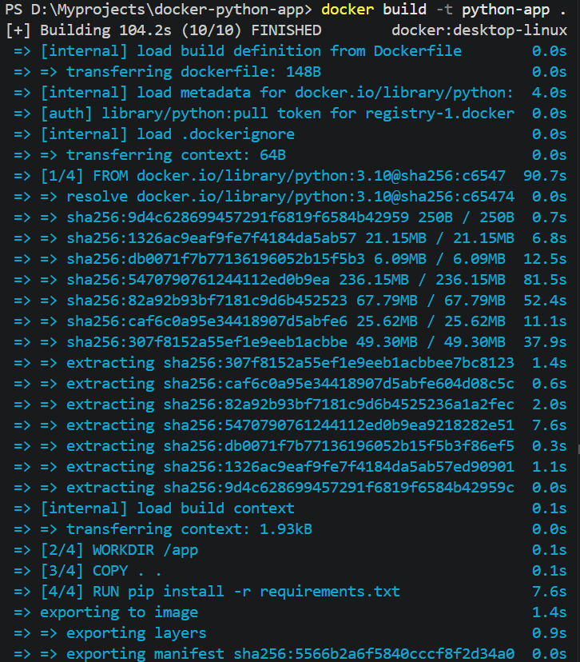
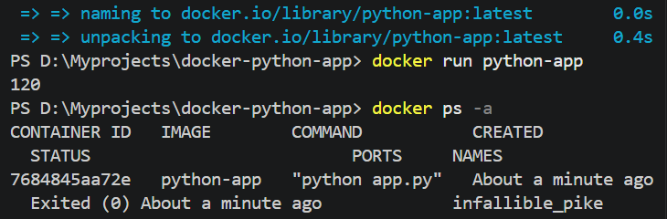

# Docker project

# 🐳 Dockerized Python Application

This project demonstrates how to containerize a simple Python application using Docker.  
The application performs a basic addition operation and is executed inside a Docker container to ensure consistent behavior across different environments.

---

## 📌 Project Overview

Docker is a containerization platform that packages an application along with all its dependencies into a single lightweight container. This eliminates environment-related issues and allows the application to run consistently on any system where Docker is installed.

In this project:

- A simple Python application is created.
- Dependencies are listed in `requirements.txt`.
- A `Dockerfile` defines how the Docker image is built.
- A `.dockerignore` file excludes unnecessary files.
- The application is built into a Docker image.
- The image is executed as a container.

---

## 🎯 Objectives

- Understand the basics of Docker.
- Learn how to write a Dockerfile.
- Build Docker images.
- Run Docker containers.
- Create portable and reproducible applications.
- Publish the project on GitHub.

---

## 🛠️ Technologies Used

- Python 3.10
- Docker
- Git
- GitHub

---

## 📂 Project Structure

```text
docker-python-app/
│── app.py
│── requirements.txt
│── Dockerfile
│── .dockerignore
└── README.md

## Output Screenshot



